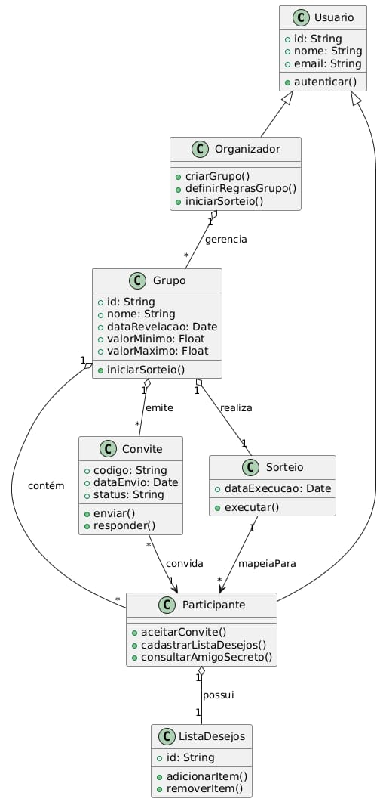
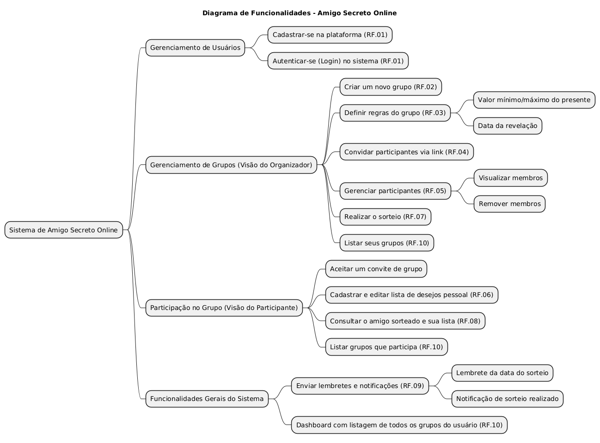
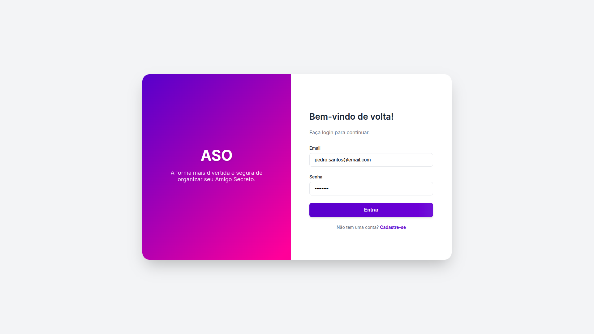
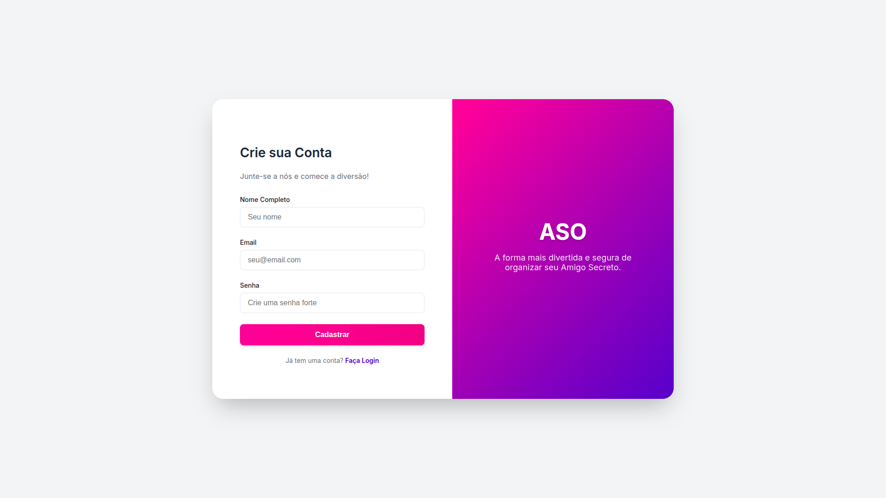
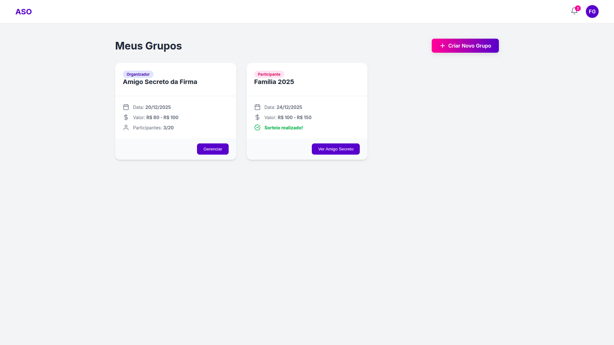
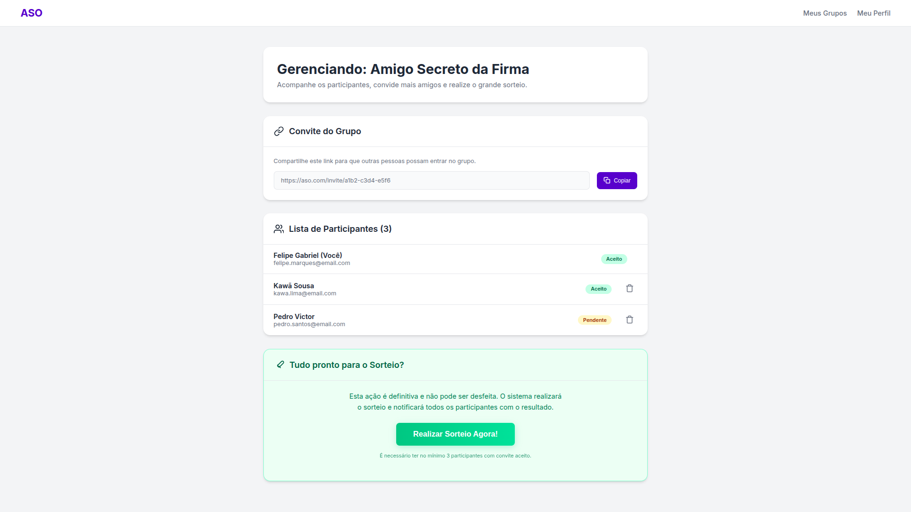
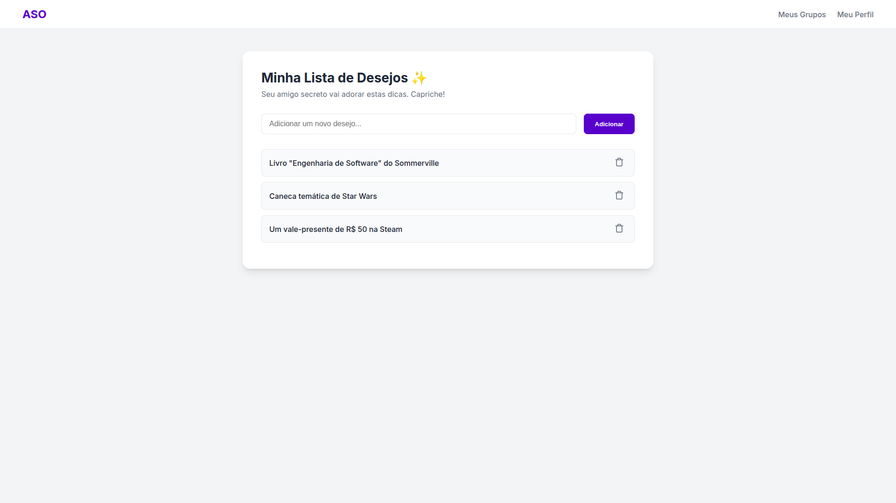
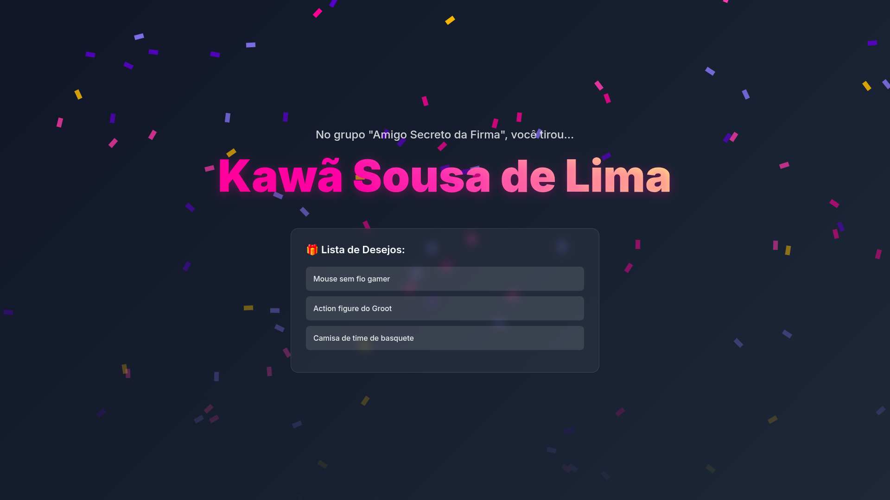

# 🎁 Amigo Secreto Online (ASO)

**ASO - Amigo Secreto Online** é um sistema web desenvolvido para facilitar, automatizar e tornar mais segura a organização de eventos de amigo secreto (ou amigo oculto) entre amigos, familiares ou colegas de trabalho.

Este projeto foi desenvolvido como parte da disciplina **Engenharia de Software II** do curso de **Análise e Desenvolvimento de Sistemas** no **Instituto Federal do Piauí – Campus Teresina Central**.

---

## 📌 Objetivo

O ASO elimina as falhas comuns no processo manual de sorteio de amigo secreto, centralizando todas as etapas em um sistema online. Isso inclui:

- Criação de grupos
- Definição de regras (valor mínimo/máximo, data da revelação)
- Envio de convites
- Sorteio automático e sigiloso
- Cadastro de listas de desejos
- Consulta ao amigo sorteado

---

## 👥 Equipe

- **Felipe Gabriel Freitas Marques**
- **Kawã Sousa de Lima**
- **Pedro Victor Venâncio dos Santos**

---

## 📄 Documento de Visão

Você pode acessar o [Documento de Visão](https://docs.google.com/document/d/188L_N060s6FnBDwB0ooZUweBJorD2OslDNWXotFwQ6o/edit?usp=sharing) no Google Docs ou [a versão em PDF](public/doc/Documeto-de-Visão-Amigo-Oculto-Online.pdf)

---

## 🔧 Funcionalidades Principais

| ID      | Funcionalidade                                                                 |
|---------|---------------------------------------------------------------------------------|
| RF.01   | Cadastro e autenticação de usuários                                             |
| RF.02   | Criação de grupos de amigo secreto                                              |
| RF.03   | Definição de regras do grupo (valor dos presentes, data da revelação, etc.)     |
| RF.04   | Convite de participantes por link                                               |
| RF.05   | Gerenciamento de participantes (ver quem aceitou, remover participantes)        |
| RF.06   | Cadastro e edição de lista de desejos                                           |
| RF.07   | Sorteio automático, aleatório e sigiloso                                        |
| RF.08   | Consulta ao amigo secreto sorteado e à sua lista de desejos                    |
| RF.09   | Envio de notificações e lembretes                                               |
| RF.10   | Listagem de todos os grupos dos quais o usuário participa ou organiza           |

---

## 🧩 Diagramas

### 📚 Diagrama de Domínio

### 🧠 Diagrama de Funcionalidades

### 🔁 Diagrama de Fluxo

---

## 💡 Tecnologias Utilizadas

- HTML (prototipação)
- Google Docs (documentação)
---

## 🚫 Fora do Escopo

- Compra e entrega dos presentes
- Comunicação em tempo real (chat entre participantes)

---

## 🧪 Protótipos de Tela
- Autenticação (Login)

- Cadastro de usuário

- Listagem de grupos com notificações

- Criação de grupo e definição de regras

- Gerenciamento do grupo (organizador)

- Cadastro e edição da lista de desejos

- Consulta ao amigo sorteado

---
## ✅ Status do Projeto
📍 Versão inicial 1.0 – entregue para a disciplina de Engenharia de Software II.
---
## 📬 Contato
Dúvidas, perguntas ou sugestões? Entre em contato com qualquer membro da equipe ou abra uma *issue* neste repositório.
---